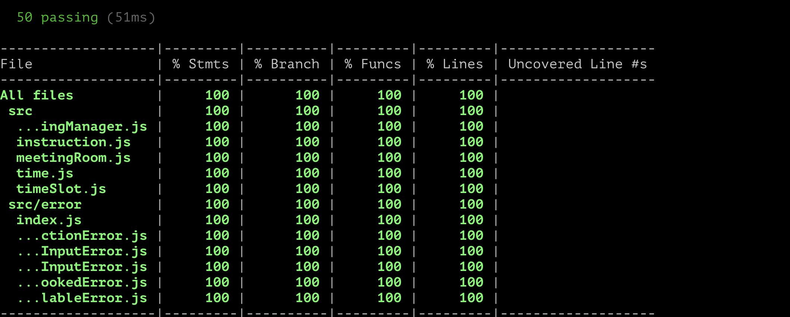

# Introduction
This is a problem assignment about making a space for coworker or individual. Where they can book a room based on given slot and capacity.

# Default Setup
By Default there are three rooms:
Name | Person Capacity
------------ | -------------
C-Cave  | 3 People
D-Tave  | 7 People
G-Mansion  | 20 People

There are three time slot for cleaning of the rooms
Start Time | End time
------------ | -------------
09:00 | 09:15
13:15 | 13:45
18:45 | 19:00

`Note`: Start time for any booking should be in fifteen minutes interval

# Setup
```
npm init
```

# Run
```
  npm start
```
or
```
npm start <file.txt>
```
By default it takes input.txt file. There are two instruction program takes:
* Booking a room:
  This instruction book a new room for given capacity and time slot
  Format:
    ```
      BOOK 11:00 11:45 2
    ```
    **Here**
    -  11:00 and 11:45 are start time and end time for that we want to book any room
    - 2 is denoting people capacity

  Output:
    ```
    C-Cave
    ```


* For getting all available room:
  This instruction fetch all available room based on given start time and end time
  Format:
    ```
      VACANCY 10:00 12:00
    ```
    **Here**
    -  11:00 and 11:45 are start time and end time for that we want to book any room

  Output:
    ```
    C-Cave D-Tower G-Mansion
    ```

More details: https://www.geektrust.in/coding-problem/backend/make-space

# Test
```
npm test --silent
```
Or
```
npm run test -- --coverage --watchAll=false
```

# code coverage
